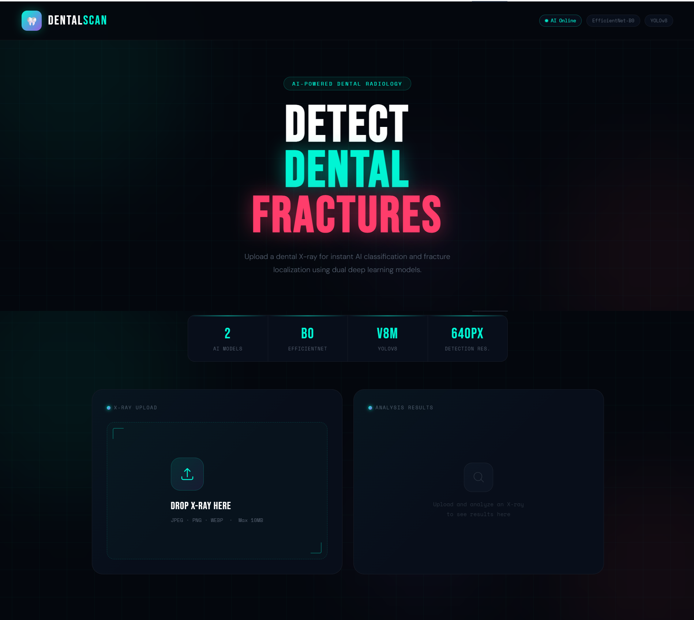

# Dental Fracture Detection using Deep Learning

A deep learning and computer vision system for detecting mandibular fractures from dental X-ray images.

The project explores binary image classification, transfer learning, hybrid machine learning, fracture localization, explainable AI, and web-based model deployment.

> **Note:** This is an academic/research prototype and is not intended for clinical diagnosis or medical decision-making.

---

## Overview

The goal of this project is to develop a computer vision pipeline capable of identifying fractures in dental X-ray images.

The project was developed through multiple stages, beginning with a custom CNN and progressing through transfer learning, CNN feature extraction with traditional machine learning classifiers, object detection, explainability, and web deployment.

---

## Application



---

## System Pipeline

```text
Dental X-ray
     │
     ▼
Image Preprocessing
     │
     ▼
Data Augmentation
     │
     ▼
Deep Learning Classification
     │
     ├───────────────┐
     ▼               ▼
Fracture        No Fracture
     │
     ▼
CNN Feature Extraction
     │
     ▼
Hybrid ML Classification
     │
     ▼
YOLOv8 Localization
     │
     ▼
Explainable AI
     │
     ├── Grad-CAM
     └── Eigen-CAM
     │
     ▼
Web-based Inference